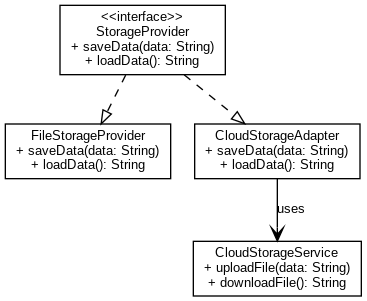

# Інтеграція нового модуля для зберігання даних

## Опис проєкту
Цей проєкт демонструє вирішення завдання інтеграції нового модуля для зберігання даних у систему, яка використовує інтерфейс `StorageProvider` для взаємодії із провайдерами зберігання. Новий модуль — це хмарне сховище, представлене стороннім API `CloudStorageService`, яке не реалізує `StorageProvider`. Щоб забезпечити його інтеграцію, використано шаблон проєктування **Adapter**.

---

## Як вирішувалася проблема
Завдання полягало в інтеграції `CloudStorageService` у систему з такими обмеженнями:
1. **Сумісність із існуючою системою**: Усі модулі повинні працювати через інтерфейс `StorageProvider`.
2. **Незмінність стороннього API**: Оригінальний `CloudStorageService` не можна змінювати.
3. **Проста інтеграція**: Існуючий код має залишитися без змін.

Для цього був реалізований адаптер `CloudStorageAdapter`, який працює як "міст" між `StorageProvider` та `CloudStorageService`.

---

## Реалізовані класи

### 1. **StorageProvider (інтерфейс)**
Основний інтерфейс для взаємодії з модулями зберігання даних. Містить два методи:
- `void saveData(String data)` — зберігає дані.
- `String loadData()` — отримує дані.

### 2. **FileStorageProvider (реалізація StorageProvider)**
Реалізація інтерфейсу `StorageProvider`, яка працює з файлами.
- **Призначення**: забезпечити зберігання даних у локальній файловій системі.
- Методи:
    - `saveData(String data)` — зберігає дані у файл.
    - `loadData()` — завантажує дані з файлу.

### 3. **CloudStorageService (стороннє API)**
Сторонній клас, який надає функції для роботи з хмарним сховищем.
- **Особливість**: не реалізує `StorageProvider` і має власний API:

### 4. **CloudStorageAdapter (адаптер)**
Клас, який реалізує `StorageProvider` і дозволяє використовувати `CloudStorageService` у системі.
- **Призначення**: адаптує методи `CloudStorageService` до інтерфейсу `StorageProvider`.
- **Використаний шаблон проєктування**: **Adapter**.
- Методи:
    - `saveData(String data)` — викликає відповідний метод `CloudStorageService` для зберігання даних у хмарі.
    - `loadData()` — викликає відповідний метод `CloudStorageService` для завантаження даних з хмари.

### 5. **Main (точка входу)**
Клас, який демонструє використання системи.
- Показує, як працювати з `FileStorageProvider` та `CloudStorageAdapter`.

---

## UML-діаграма
### Проєкт спроєктовано відповідно до UML-діаграми, яка представлена нижче:

---

## Висновки
Цей проєкт демонструє:
- Як інтегрувати сторонній API в існуючу систему, використовуючи патерн **Adapter**.
- Як забезпечити зручність і гнучкість у розширенні функціональності без зміни існуючого коду.

Використання інтерфейсу `StorageProvider` гарантує незалежність системи від конкретних реалізацій зберігання даних. Adapter дозволяє легко підключати нові модулі, навіть якщо вони мають несумісний API.

---
